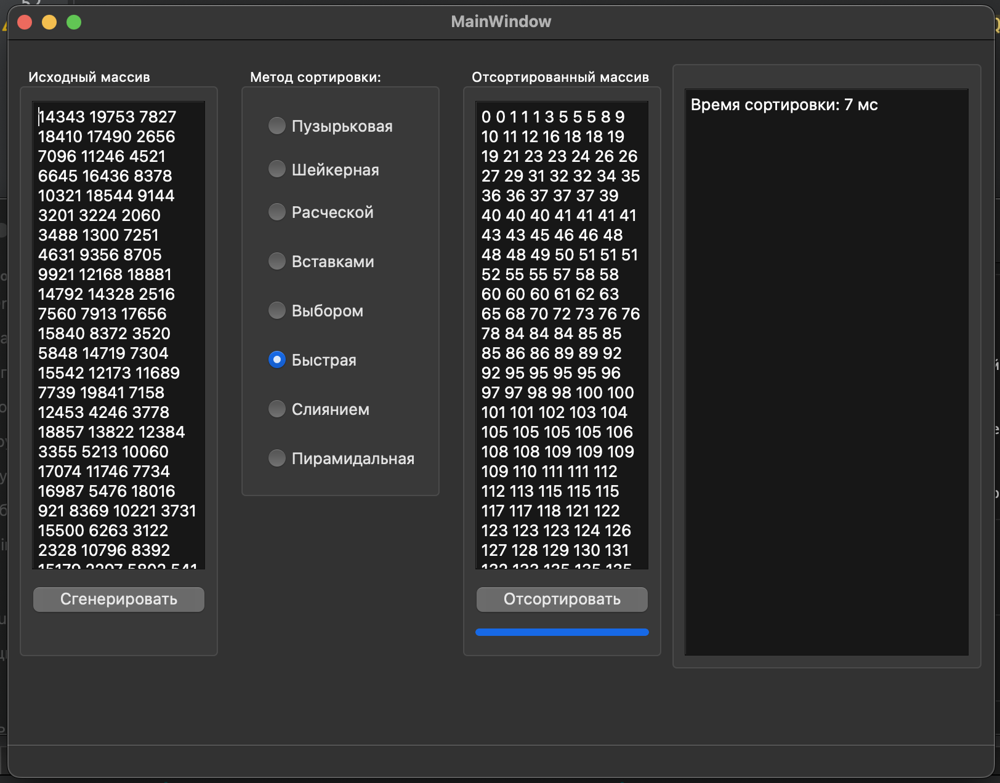

# Array Sorting with Various Algorithms

## Description
The program generates a random array and provides the user with the ability to choose one of eight sorting algorithms to process it. The sorting result is displayed in a text field, and the time taken for sorting is also shown.

University laboratory work on object-oriented programming.

---

## Project Structure
1. **mainwindow.cpp** – The main file containing the implementation of the application window functionality, event handlers, and logic for array generation and sorting.
2. **sort.h** – Header file describing all sorting algorithms available for use.
3. **sort.cpp** – File implementing the sorting algorithms.
4. **mainwindow.ui** – User interface described in XML format.

---

## Program Description

### Main Functions

1. **Array Generation**:
    - The program generates a random array of integers with a size of 20000 elements.
    - The array is displayed in a text field.

2. **Selecting a Sorting Algorithm**:
    - The user can choose one of eight sorting algorithms:
        - BubbleSort
        - ShakerSort
        - CombSort
        - InsertionSort
        - SelectionSort
        - QuickSort
        - MergeSort
        - HeapSort
    - Each algorithm is implemented in a separate function using standard algorithms and methods.

3. **Sorting Process**:
    - When the user clicks the "Sort" button, the selected algorithm sorts the array.
    - The sorting execution time is displayed in a text field.

### Sorting Algorithms

- **BubbleSort**: Sorting using the bubble method.
- **ShakerSort**: An improved version of bubble sort.
- **CombSort**: Sorting using the "comb" method.
- **InsertionSort**: Sorting by insertion.
- **SelectionSort**: Sorting by selection.
- **QuickSort**: Quick sort.
- **MergeSort**: Merge sort.
- **HeapSort**: Heap sort.

---

### Technical Details
The interface is built using Qt. It features buttons for array generation and starting the sort, and text fields for displaying the array and the result.

---

## TODO
- Add the ability to select the array size for generation.
- Improve the progress bar visualization by adding more detailed information about the execution progress.